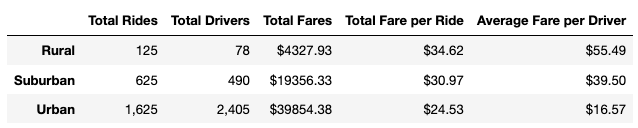
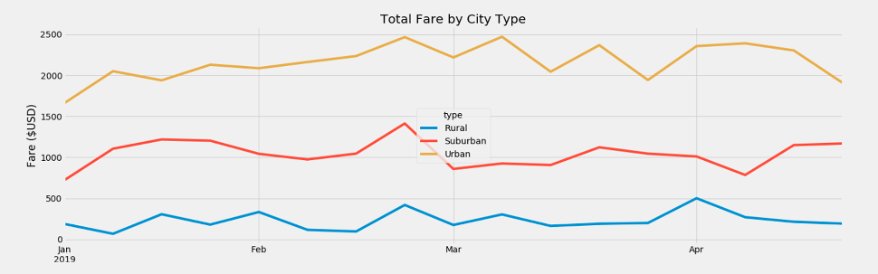

# PyBer_Anlysis

## Overview 
The CEO of a ride-sharing app has requested an analysis of 5 months worth of data. The goal is to help improve access to ride-sharing services and determine affordability for underserved neighborhoods. After working through summary statistics chart plotting, and regression models to ensure no variables are overly skewed, the focus of the analysis is now on three key city types: urban, rural and suburban.

## Resources
* Pyber_ride_data.csv
* city_data.csv
* ride_data.csv
* SoftwarePython 3.7.13, Jupyter Notebook

## Results

## Summary
* Peak months are similar across each city type except for suburban areas in the summer in comparison to rural.
* Urban areas generate the most revenue with a lowest return on fare per ride than fare per driver. A test could be conducted to see if cheaper fares capture more riders who may be taking other public transport or other, further increasing revenue.
* Suburban areas generate the second most revenue, but at nearly half of Urban due to less rides and drivers. Add more drivers by increasing the revenue by increasing the price per fare.
* Rural areas generate the least revenue at nearly less than a half of total rides and drivers. Add more drivers by increasing the revenue by increasing the price per fare.

